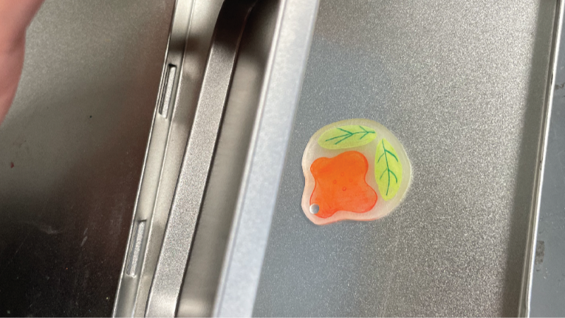

## Shrink Plastic Workshop- instructions

*   Get a piece of shrink plastic.
    
    
    
*   Draw on the side with texture, not on the reflective surface.
*   Keep in mind that the shrink plastic will reduce in size after heating. If you want your final product to be 5cm \* 5cm, please draw the size at 10cm \* 10cm.
    
    
    
*   Wait for your drawing to dry, and then cut along the edges.
*   To ensure even heating, use a heat gun to preheat the metal plate.
    
    
    
*   Evenly heat the shrink plastic with hot air. Now the plastic will become soft and get smaller. When it curls up, don't worry, continue blowing with hot air, and it will become flatter.
    
    
    
    
    
*   Once the shrink plastic has shrunk and flattened, you can quickly place it under a metal lid to flatten it.
    
    
    
*   After 5 seconds, remove.
*   On the side of the drawing, evenly pour UV resin and flatten it with a piece of small shrink plastic. Place it under UV light.
    
    
    
    
    
*   For larger pieces, they need to be exposed to UV light for a longer period of time. You can remove them at intervals of 90 seconds to check the curing level.
    
    
    
*   Place earrings or magnets on the back, pour UV resin, and place under UV light to cure.
    
    
